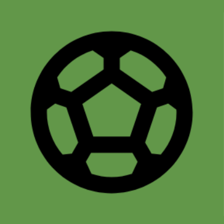

# Slidetackle  
(*Obs.: esse aplicativo foi desenvolvido como um desafio de projeto da [DIO](https://www.dio.me/) para o bootcamp "Santander Mobile Developer".*)  

O nome do app refere-se a uma manobra de futebol chamada “*slide tackle*” ou “*sliding tackle*”, conhecida em português como “carrinho”.  

## **Funcionalidades**
Além da leitura de notícias nacionais e internacionais sobre futebol feminino, permite compartilhar e favoritar notícias.

## **Implementações e ferramentas utilizadas** 
- [Analytics](https://firebase.google.com/products/analytics), 
[Crashlytics](https://firebase.google.com/products/crashlytics), 
[Gson](https://square.github.io/retrofit/), 
[Picasso](https://square.github.io/picasso/), 
[RecyclerView](https://developer.android.com/guide/topics/ui/layout/recyclerview), 
[Retrofit](https://square.github.io/retrofit/), 
[Room](https://developer.android.com/training/data-storage/room), 
[SwipeRefreshLayout](https://developer.android.com/jetpack/androidx/releases/swiperefreshlayout) 
e [ViewBinding](https://developer.android.com/topic/libraries/view-binding).
- [Simulação de API utilizada no projeto](https://github.com/gabriwls/api-slidetackle).  

## **Design da interface**
- **Cores**:
   - Apesar do foco no futebol *feminino*, decidi usar o verde como a cor primária do aplicativo, como forma de remeter aos gramados, em vez do já batido rosa.

- **Temas**:
  - No tema escuro, optei por não atribuir cor à status bar, como forma de tornar a visualização da interface mais leve aos olhos, que é o que geralmente procuram aqueles que usam esse tipo de tema.
  
- **Ícones**:
  - **Notícias**: nos jogos, os apitos são uma forma de chamar a atenção. Similarmente, as notícias também são algo a que deve estar atento. Portanto, foi escolhido um apito.  
  - **Favoritos**: apesar de, atualmente, muitos aplicativos utilizarem corações para simbolizar favoritos, estrelas parecem ter uma ligação maior com o futebol (as estrelas na camisa da Seleção Brasileira, por exemplo). Assim, foi escolhida uma estrela.
  
### Capturas de tela
- **Tema claro**:  

  
   

  

- **Tema escuro**:

  
   

